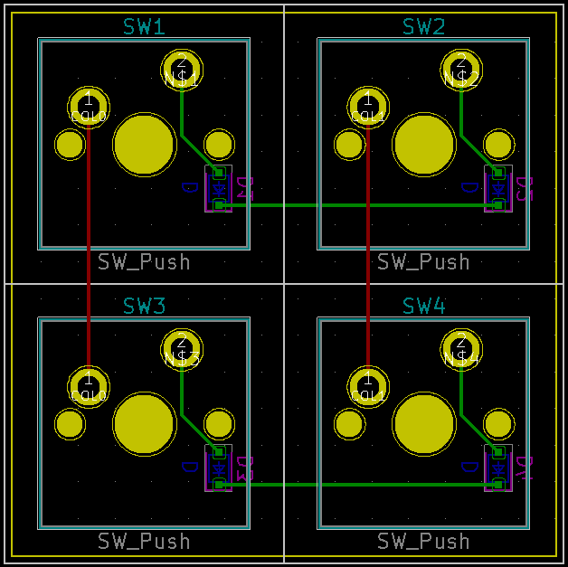
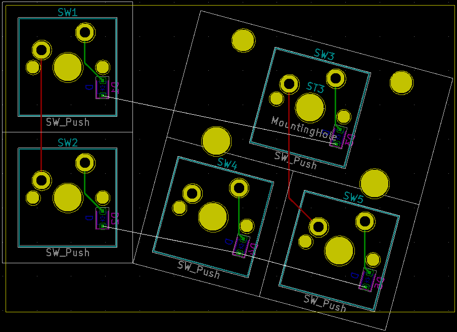

# Keyboard tools

## About
Features:
 - KiCAD project generator for mechanical keyboards with web interface.

### Examples
[keyboard-layout-editor](www.keyboard-layout-editor.com) | KiCad PCB
--- | ---
<br />[json](examples/key-placement/2x2.json) | 
<br />[json](examples/key-placement/3x2-sizes.json) | 
<br />[json](examples/key-placement/2x3-rotations.json) | 

For recommended workflow see [workflow guide](examples/workflow/README.md)

## Environment setup

You need to have [Go](https://golang.org/),
[Node.js](https://nodejs.org/),
[Docker](https://www.docker.com/), and
[Docker Compose](https://docs.docker.com/compose/)
(comes pre-installed with Docker on Mac and Windows)
installed on your computer.

Verify the tools by running the following commands:

```sh
go version
npm --version
docker --version
docker-compose --version
```

## Start in development mode

From `kicad-api` directory run the command (you might
need to prepend it with `sudo` depending on your setup):

```sh
docker-compose up
```
This starts a `kicad` specific containers required by `server`.

Navigate to the `server` folder and start the back end:

```sh
cd server
go run server.go
```
The back end will serve on http://localhost:8080.

Navigate to the `webapp` folder, install dependencies,
and start the front end development server by running:

```sh
cd webapp
npm install
npm start
```
The application will be available on http://localhost:3000.

## Start in production mode (not working yet)

From `kicad-api` directory run:
```sh
docker-compose up
```

Next, from project root perform:
```sh
docker-compose up
```
This will build the application and start.
Access the application on http://localhost:8080.

### Credits
- keyboard layout file serialized by [kle-serial](https://github.com/ijprest/kle-serial)
- netlist generated with [skidl](https://github.com/xesscorp/skidl) based [kle2netlist](https://github.com/adamws/kle2netlist)
- switch footprints by [MX_Alps_Hybrid](https://github.com/ai03-2725/MX_Alps_Hybrid)
- key placement with [kicad-kbplacer](https://github.com/adamws/kicad-kbplacer)
- pcb preview generated with [pcbdraw](https://github.com/yaqwsx/PcbDraw)
- project structure generated with [goxygen](https://github.com/Shpota/goxygen)
