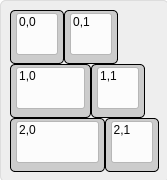
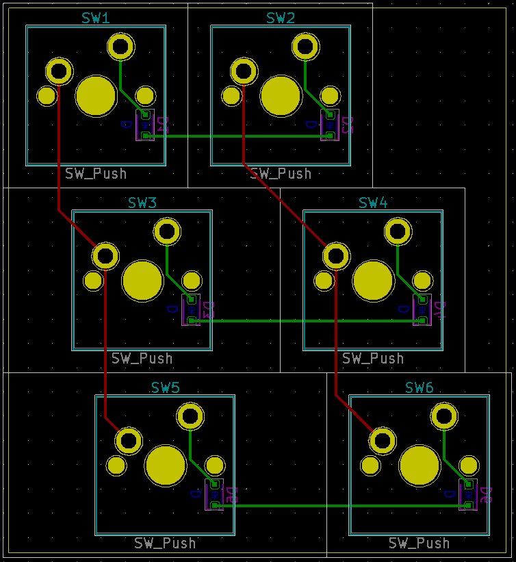
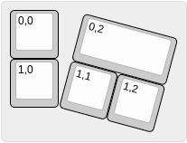

# Keyboard tools

## KiCad project generator

Features:

- web interface available at [keyboard-tools.xyz](http://keyboard-tools.xyz)
- two switch libraries to choose from: [MX_Alps_Hybrid](https://github.com/ai03-2725/MX_Alps_Hybrid)
  and [Switch_Keyboard](https://github.com/perigoso/Switch_Keyboard)
- three available switch footprints: Cherry MX, Alps and Cherry MX/Alps hybrid
- key rotations thanks to patched [kle-serial](https://github.com/ijprest/kle-serial)
- supports basic pre-routing

Limitations:

- routing algorithm is currently very simplified. It will not work correctly for
  certain switch rotation angles. Also there is no automatic DRC rule check,
  hence is some situations, tracks might be too close to pads or mounting holes.
- routing algorithm doesn't work for Alps & MX/Alps Hybrid when [Switch_Keyboard](https://github.com/perigoso/Switch_Keyboard)
  in use, see this [issue](https://github.com/perigoso/Switch_Keyboard/issues/4)

**Disclaimer:** this project is under active development.
Website should be running latest master revision but it may be unstable and buggy.

### Examples

[keyboard-layout-editor](http://www.keyboard-layout-editor.com) | KiCad PCB (with routing enabled)
--- | ---
<br/>[json](examples/key-placement/2x2.json) | 
<br/>[json](examples/key-placement/3x2-sizes.json) | 
<br/>[json](examples/key-placement/2x3-rotations.json) | <br/>Note: Routing for rotated switches may be incomplete

For recommended workflow see [workflow guide](examples/workflow/README.md)

## KLE converter

- use [kle-serial](https://github.com/ijprest/kle-serial) via web interface at [keyboard-tools.xyz/kle-converter](http://keyboard-tools.xyz/kle-converter)
- includes [patch](https://github.com/ijprest/kle-serial/pull/1) which fix
  rotated key issue

## For developers

### Environment setup

You need to have [Go](https://golang.org/),
[Node.js](https://nodejs.org/),
[Docker](https://www.docker.com/), and
[Docker Compose](https://docs.docker.com/compose/)
(comes pre-installed with Docker on Mac and Windows)
installed on your computer.

Verify the tools by running the following commands:

```sh
go version
npm --version
docker --version
docker-compose --version
```

### Start in development mode

From `kicad-api` directory run the command (you might
need to prepend it with `sudo` depending on your setup):

```sh
docker-compose up
```

This starts a `kicad` specific containers required by `server`.

Navigate to the `server` folder and start the back end:

```sh
cd server
go run server.go
```

The back end will serve on http://localhost:8080.

Navigate to the `webapp` folder, install dependencies,
and start the front end development server by running:

```sh
cd webapp
npm install
npm start
```

The application will be available on http://localhost:3000.

### Start in production mode

From project root perform:

```sh
docker-compose up
```

This will build the application and start.
Access the application on http://localhost

## Credits

- keyboard layout file serialized by [kle-serial](https://github.com/ijprest/kle-serial)
- netlist generated with [skidl](https://github.com/xesscorp/skidl) based [kle2netlist](https://github.com/adamws/kle2netlist)
- switch footprints by [MX_Alps_Hybrid](https://github.com/ai03-2725/MX_Alps_Hybrid)
  and [Switch_Keyboard](https://github.com/perigoso/Switch_Keyboard)
- key placement with [kicad-kbplacer](https://github.com/adamws/kicad-kbplacer)
- pcb preview generated with [pcbdraw](https://github.com/yaqwsx/PcbDraw)
- project structure generated with [goxygen](https://github.com/Shpota/goxygen)
